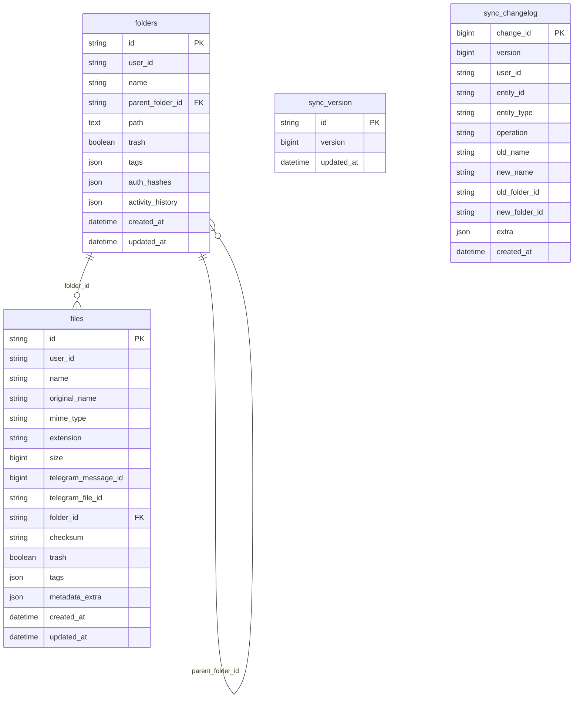

# TG Drive

**A self-hosted cloud storage platform that uses Telegram's infrastructure as its file storage backend, providing a Google Drive–class web interface with unlimited storage capacity.**

TG Drive lets you turn Telegram channels into your own private cloud drive. Files are stored permanently in Telegram's distributed cloud, while a shared database tracks metadata. The application provides a full-featured web UI with media streaming, folder hierarchies, sharing, search, and multi-client synchronization.

---

## Overview

**What it does:** TG Drive turns any Telegram channel into an unlimited, private cloud storage system. Users upload files through a web interface; the backend stores them in a Telegram channel and records metadata in a database. Multiple browser clients (local and remote) stay synchronized via WebSocket push and polling.

**Problem it solves:** Cloud storage with no recurring costs, no storage limits, and full data ownership — leveraging Telegram's existing infrastructure for file persistence.

**How it works:** When a user uploads a file, the backend sends it to Telegram via the MTProto API using a pool of bot accounts, then records the file's metadata (name, size, Telegram message ID, checksum) in a shared database. Downloads reverse the process: the backend fetches the file from Telegram and streams it to the browser. A synchronization engine tracks every mutation (create, rename, move, trash, delete) with versioned changelog entries, allowing multiple browser clients to stay in sync in real time.

**Who it's for:** Developers and power users who want a self-hosted, Telegram-backed personal cloud storage with a polished web UI.

---

## Features

### File & Folder Management
- Hierarchical nested folder structure with stable IDs
- List and grid view modes
- Drag & drop upload (files and entire directories)
- Multi-select with bulk actions (move, delete, trash, download as ZIP)
- Right-click context menus and keyboard shortcuts
- Recycle bin with soft-delete and instant restore

### Media Streaming & Previews
- In-browser video/audio streaming with HTTP 206 range seeking
- On-the-fly thumbnail generation with RAM and disk caching
- PDF document viewer
- Syntax-highlighted code viewer (30+ languages)
- Image lightbox with pan, zoom, and full-screen

### Transfer System
- Multi-bot upload pool for parallel concurrency
- Live progress tracking (speed, ETA, percentage)
- Pause, cancel, and auto-retry on failure
- Telegram Premium session support for files up to 4 GB

### Search & Organization
- Full-text filename search
- Type, size, and date range filters
- Custom color tagging system
- SHA-256–based duplicate file detection and cleanup

### Sharing
- Tokenized public share links for files and folders
- Scoped guest access (isolated to the shared directory)
- Password-protected shares
- On-the-fly ZIP downloads for shared folders

### Security
- Two-factor authentication (password + email OTP)
- PBKDF2 password hashing with constant-time comparison
- HttpOnly session cookies with SameSite and Secure attributes
- Rate limiting on login and OTP endpoints
- Path traversal and injection prevention
- Content Security Policy headers

### Synchronization (Multi-Client)
- WebSocket push notifications for real-time updates
- Polling fallback (8-second interval)
- Versioned changelog for reliable catch-up after offline periods
- Cross-tab synchronization via BroadcastChannel
- Sync status indicator in the UI

### Administration
- Health and readiness probes (`/health/live`, `/health/ready`)
- Automatic database backup to Telegram channel
- Drive data integrity scanning
- Channel message scanning and recovery

---

## Technology Stack

| Category | Technology |
| -------- | ---------- |
| Backend framework | FastAPI + Uvicorn |
| Telegram client | Pyrogram (MTProto API) |
| Database ORM | SQLAlchemy 2.0 |
| Database | PostgreSQL (shared cloud) / SQLite (local fallback) |
| Migrations | Alembic |
| Frontend | Vanilla HTML5 / CSS3 / JavaScript (no framework) |
| Styling | Custom CSS (Google Drive–inspired design) |
| Image processing | Pillow |
| Archive handling | Python `zipfile` (with security limits) |
| Password hashing | PBKDF2-HMAC-SHA256 |
| Email delivery | Resend API / SMTP |
| Containerization | Docker + Docker Compose |
| Android packaging | Capacitor (hybrid native shell) |

---

## Architecture

```
                    ┌─────────────────────────┐
                    │     Browser (SPA)       │
                    │  HTML / CSS / Vanilla JS │
                    └──────────┬──────────────┘
                               │ REST API + WebSocket + HTTP Streams
                    ┌──────────▼──────────────┐
                    │    FastAPI + Uvicorn     │
                    │  Auth · Upload · Stream  │
                    │  Sync · Search · Share   │
                    └─────┬────────────┬──────┘
                          │            │
               ┌──────────▼──┐  ┌──────▼──────────┐
               │  PostgreSQL  │  │ Telegram Cloud   │
               │  / SQLite    │  │ (MTProto API)    │
               │  Metadata    │  │ File Storage     │
               └──────────────┘  └─────────────────┘
```

**Key principle:** The database is the source of truth for metadata. Telegram is the source of truth for file contents. Multiple FastAPI instances (localhost + Render) can connect to the same shared database and Telegram channel, staying synchronized through the versioned changelog system.

---

## Project Structure

```
tg-drive/
├── main.py                        # FastAPI application entry point (92+ API routes)
├── config.py                      # Environment variable loading and validation
├── start_main.py                  # Quick-start helper (uvicorn --reload)
├── migrate_to_db.py               # Legacy drive.data → database migration
├── tgdrive_backup.py              # Telegram backup CLI tool
├── database/
│   ├── __init__.py
│   ├── connection.py              # SQLAlchemy engine, session management, init_db()
│   ├── models.py                  # ORM models (Folder, File, SyncVersion, ChangeLog)
│   └── repository.py              # CRUD operations, sync queries, version management
├── alembic/
│   ├── env.py                     # Alembic configuration
│   ├── alembic.ini
│   └── versions/
│       ├── 0001_initial_schema.py # folders + files tables
│       └── 0002_sync_tables.py    # sync_version + sync_changelog tables
├── utils/
│   ├── auth.py                    # Session management, OTP, rate limiting
│   ├── clients.py                 # Telegram client initialization
│   ├── directoryHandler.py        # In-memory drive tree + DB sync
│   ├── uploader.py                # Telegram file upload with flood protection
│   ├── downloader.py              # Telegram file download
│   ├── transfer_manager.py        # Upload/download queue with retry
│   ├── streamer.py                # HTTP range-request media streaming
│   ├── properties.py              # File metadata enrichment
│   ├── duplicate_manager.py       # SHA-256 duplicate detection
│   ├── shareManager.py            # Tokenized sharing system
│   ├── archive_manager.py         # ZIP inspection and extraction
│   ├── zipper.py                  # On-the-fly ZIP archive creation
│   ├── email_service.py           # OTP email delivery
│   ├── bot_mode.py                # Telegram bot direct commands
│   ├── logger.py                  # Application logging
│   ├── extra.py                   # Utilities (auto-ping, BroadcastChannel)
│   ├── tg_gate.py                 # Telegram API flood-wait management
│   ├── sync.py                    # Change tracking engine (ChangeTracker, SyncService)
│   ├── sync_routes.py             # /api/sync/* endpoints + WebSocket
│   └── websocket_manager.py       # WebSocket connection manager
├── website/
│   ├── home.html                  # Main SPA shell
│   ├── share.html                 # Public share page
│   ├── VideoPlayer.html           # Standalone video player
│   └── static/
│       ├── home.css               # Main stylesheet (7400+ lines)
│       ├── manifest.json          # PWA manifest
│       ├── sw.js                  # Service worker
│       ├── assets/                # Icons and static assets
│       ├── css/                   # Component stylesheets
│       └── js/
│           ├── main.js            # Core directory renderer (4600+ lines)
│           ├── apiHandler.js      # API client, upload queue, search
│           ├── extra.js           # SPA routing, BroadcastChannel sync
│           ├── sidebar.js         # Navigation sidebar
│           ├── fileClickHandler.js # File interactions (preview, rename, delete)
│           ├── transferManager.js  # Transfer queue UI
│           ├── archiveManager.js   # Archive extraction UI
│           ├── duplicates.js       # Duplicate manager UI
│           ├── syncClient.js       # WebSocket + polling sync client
│           └── share.js            # Share page logic
├── tests/                         # Additional test files
├── test_*.py                      # 14 test suites (security, sync, shares, etc.)
├── data/                          # SQLite database (local mode)
├── cache/                         # Thumbnail cache, drive data
├── downloads/                     # Temporary download storage
├── Dockerfile                     # Python 3.12 slim multi-stage build
├── docker-compose.yml             # Container orchestration
├── requirements.txt               # Python dependencies
├── .env.example                   # Environment variable template
├── sample.env                     # Simpler env template
├── LICENSE                        # MIT License
├── SECURITY.md                    # Vulnerability reporting policy
└── CAPACITOR_ANDROID_GUIDE.md     # Android APK packaging guide
```

---

## Prerequisites

- **Python** 3.11 or later (tested up to 3.14)
- **Telegram Bot Token(s)** — obtain from [@BotFather](https://t.me/BotFather)
- **Telegram API credentials** — obtain from [my.telegram.org](https://my.telegram.org/auth) (`API_ID` and `API_HASH`)
- **A Telegram storage channel** — created manually; the bot must be added as an Administrator
- **PostgreSQL** (recommended for multi-client sync) or **SQLite** (local single-instance fallback)
- **Docker** (optional, for containerized deployment)

---

## Installation

### Local Setup

```bash
git clone <repository-url>
cd tg-drive

# Install Python dependencies
pip install -r requirements.txt

# Create your environment configuration
cp .env.example .env
# Edit .env with your Telegram credentials and admin password
```

### Environment Configuration

Copy `.env.example` to `.env` and fill in the required values:

| Variable | Required | Description |
| -------- | -------- | ----------- |
| `TELEGRAM_API_ID` | Yes | Telegram API ID from [my.telegram.org](https://my.telegram.org/auth) |
| `TELEGRAM_API_HASH` | Yes | Telegram API Hash from [my.telegram.org](https://my.telegram.org/auth) |
| `TELEGRAM_BOT_TOKEN` | Yes | Bot token(s) from [@BotFather](https://t.me/BotFather), comma-separated for multi-bot pool |
| `TELEGRAM_CHAT_ID` | Yes | Storage channel ID (e.g. `-1001234567890`) or channel username (`@my_channel`) |
| `ADMIN_PASSWORD` | Yes | Strong password for the web UI (minimum 8 characters, not a default value) |
| `DATABASE_URL` | No | PostgreSQL connection string for shared cloud mode. If empty, falls back to local SQLite |
| `DATABASE_BACKUP_MSG_ID` | No | Set to `0` for new setups (auto-creates backup message). Default: `0` |
| `ADMIN_EMAIL` | No | Email for OTP 2FA verification codes |
| `RESEND_API_KEY` | No | Resend API key for reliable OTP email delivery |
| `SMTP_HOST` | No | SMTP host for OTP delivery (default: `smtp.gmail.com`) |
| `SMTP_PORT` | No | SMTP port (default: `587`) |
| `SMTP_USER` | No | SMTP username |
| `SMTP_PASSWORD` | No | SMTP password / app password |
| `STRING_SESSIONS` | No | Telegram Premium Pyrogram sessions (unlocks 4 GB upload limit) |
| `SECRET_KEY` | No | Session signing key (auto-generated if not set) |
| `CORS_ORIGINS` | No | Allowed CORS origins (default: `*`) |
| `SESSION_HOURS` | No | Session lifetime in hours (default: `12`) |
| `DATABASE_BACKUP_TIME` | No | Auto-backup interval in seconds (default: `60`) |
| `WEBSITE_URL` | No | Public URL for the auto-pinger (keeps free hosting awake) |
| `MAIN_BOT_TOKEN` | No | Bot token for Telegram Bot Direct Upload Mode |
| `TELEGRAM_ADMIN_IDS` | No | Comma-separated Telegram User IDs for Bot Mode access |
| `ARCHIVE_MAX_EXTRACT_SIZE_GB` | No | Max extractable archive size in GB (default: `2`) |
| `ARCHIVE_MAX_EXTRACT_FILES` | No | Max files per archive extraction (default: `10000`) |
| `ARCHIVE_MAX_NESTING_DEPTH` | No | Max archive directory depth (default: `32`) |
| `ARCHIVE_MAX_RATIO` | No | Max compression ratio for zip-bomb detection (default: `200`) |

> **Important:** Your Telegram bot must be added to the storage channel as an **Administrator** with permissions to Post Messages, Edit Messages, Pin Messages, and Delete Messages.

---

## Running the Project

### Development Server

```bash
uvicorn main:app --reload --port 8000
```

Then open [http://localhost:8000](http://localhost:8000) in your browser.

### Quick Start (Alternative)

```bash
python start_main.py
```

### Production Server

```bash
uvicorn main:app --host 0.0.0.0 --port 8000 --proxy-headers --forwarded-allow-ips=*
```

---

## Deployment

### Docker

```bash
# Build and start
docker compose up -d --build

# Check health
curl http://localhost:8000/health/live
curl http://localhost:8000/health/ready

# View logs
docker compose logs -f
```

The Docker Compose configuration mounts `./cache` and `./downloads` as persistent volumes and includes health checks.

### Render (Cloud)

1. Push the repository to GitHub.
2. Create a new **Web Service** on [Render Dashboard](https://dashboard.render.com/).
3. Configure:
   - **Environment:** Python 3
   - **Build Command:** `pip install -r requirements.txt`
   - **Start Command:** `uvicorn main:app --host 0.0.0.0 --port $PORT --proxy-headers --forwarded-allow-ips=*`
4. Add environment variables (same as `.env`).
5. Deploy.

For multi-client sync (localhost + Render), set `DATABASE_URL` to a shared PostgreSQL database (e.g., [Neon](https://neon.tech), [Supabase](https://supabase.com), or [Railway](https://railway.app)) so both instances read and write the same metadata.

### Android APK

See [`CAPACITOR_ANDROID_GUIDE.md`](CAPACITOR_ANDROID_GUIDE.md) for instructions on packaging the web UI as a native Android application using Capacitor.

---

## API Documentation

The backend exposes 92+ API routes. All authenticated endpoints require a valid session cookie.

### Health Probes

| Method | Endpoint | Description | Auth |
| ------ | -------- | ----------- | ---- |
| GET | `/health/live` | Liveness probe — process is alive | No |
| GET | `/health/ready` | Readiness probe — Telegram + DB connected | No |
| GET | `/health` | Combined health status | No |

### Authentication

| Method | Endpoint | Description | Auth |
| ------ | -------- | ----------- | ---- |
| POST | `/api/checkPassword` | Direct password verification (CLI tools) | No |
| POST | `/api/login` | Step 1: Email + password → sends OTP | No |
| POST | `/api/verifyOtp` | Step 2: Verify OTP → creates session | No |
| POST | `/api/logout` | Destroy session | Yes |

### Directory Operations

| Method | Endpoint | Description | Auth |
| ------ | -------- | ----------- | ---- |
| POST | `/api/getDirectory` | List folder contents with breadcrumbs | Yes |
| POST | `/api/createNewFolder` | Create a new folder | Yes |
| POST | `/api/createFolderTree` | Create nested folder hierarchy | Yes |
| POST | `/api/moveFileFolder` | Move file or folder | Yes |
| POST | `/api/copyFileFolder` | Copy file or folder | Yes |
| POST | `/api/renameFileFolder` | Rename file or folder | Yes |
| POST | `/api/trashFileFolder` | Soft-delete to trash | Yes |
| POST | `/api/deleteFileFolder` | Permanent delete | Yes |
| POST | `/api/bulkDelete` | Delete multiple items | Yes |
| POST | `/api/bulkTrash` | Trash multiple items | Yes |

### Upload & Download

| Method | Endpoint | Description | Auth |
| ------ | -------- | ----------- | ---- |
| POST | `/api/upload` | Upload file to Telegram (multipart) | Yes |
| POST | `/api/checkFileExists` | Pre-upload conflict check | Yes |
| POST | `/api/getSaveProgress` | Server-side save progress | Yes |
| POST | `/api/getUploadProgress` | Telegram upload progress | Yes |
| POST | `/api/getActiveUploads` | List active uploads | Yes |
| POST | `/api/cancelUpload` | Cancel an upload | Yes |
| GET | `/file` | Download/preview a file (HTTP range) | Conditional |
| GET | `/thumbnail` | File thumbnail (with ETag caching) | Conditional |
| POST | `/api/getFileInfoFromUrl` | Get metadata from URL | Yes |
| POST | `/api/startFileDownloadFromUrl` | Download file from URL to Telegram | Yes |

### ZIP & Archives

| Method | Endpoint | Description | Auth |
| ------ | -------- | ----------- | ---- |
| GET | `/downloadZip` | Download folder/selection as ZIP | Conditional |
| POST | `/api/downloadZip` | Initiate bulk ZIP preparation | Yes |
| GET | `/api/archive/list_formats` | List supported archive formats | Yes |
| POST | `/api/archive/inspect` | Inspect archive contents | Yes |
| POST | `/api/archive/extract` | Extract archive to drive folder | Yes |

### Search & Properties

| Method | Endpoint | Description | Auth |
| ------ | -------- | ----------- | ---- |
| POST | `/api/search` | Deep search with filters | Yes |
| GET | `/api/files/{id}/properties` | File metadata and properties | Conditional |
| GET | `/api/folders/{id}/properties` | Folder metadata and properties | Conditional |
| GET | `/api/files/{id}/activity` | File activity history | Conditional |
| POST | `/api/properties/enrich` | Trigger metadata extraction | Yes |

### Sharing

| Method | Endpoint | Description | Auth |
| ------ | -------- | ----------- | ---- |
| POST | `/api/share/create` | Create share link | Yes |
| POST | `/api/share/revoke` | Revoke share link | Yes |
| POST | `/api/share/regenerate` | Regenerate share token | Yes |
| POST | `/api/share/list` | List active shares | Yes |
| POST | `/api/share/update` | Update share settings | Yes |
| GET | `/s/{token}` | Access shared folder | Via token |
| GET | `/share/{token}/file/{path}` | Download shared file | Via token |
| GET | `/share/{token}/zip` | Download shared folder as ZIP | Via token |

### Transfer Manager

| Method | Endpoint | Description | Auth |
| ------ | -------- | ----------- | ---- |
| GET | `/api/transfers` | List all transfers | Yes |
| GET | `/api/transfers/{id}` | Get single transfer details | Yes |
| POST | `/api/transfers/{id}/cancel` | Cancel transfer | Yes |
| POST | `/api/transfers/{id}/retry` | Retry failed transfer | Yes |
| POST | `/api/transfers/clear` | Clear finished transfers | Yes |

### Duplicate Detection

| Method | Endpoint | Description | Auth |
| ------ | -------- | ----------- | ---- |
| GET | `/api/duplicates/status` | Scan status and stats | Yes |
| POST | `/api/duplicates/scan` | Start background scan | Yes |
| POST | `/api/duplicates/list` | Get duplicate groups | Yes |
| POST | `/api/duplicates/delete` | Delete/trash duplicates | Yes |

### Synchronization

| Method | Endpoint | Description | Auth |
| ------ | -------- | ----------- | ---- |
| GET | `/api/sync/status` | Current sync version and timestamp | Yes |
| GET | `/api/sync/changes?since=N` | Changes since version N | Yes |
| WS | `/api/sync/ws` | WebSocket for real-time push events | Yes |

### Administration

| Method | Endpoint | Description | Auth |
| ------ | -------- | ----------- | ---- |
| GET | `/api/admin/integrityReport` | Database vs. in-memory consistency check | Yes |
| POST | `/api/admin/reloadDriveData` | Force reload from database | Yes |
| GET | `/api/admin/scanChannelMessages` | Scan Telegram channel messages | Yes |
| POST | `/api/admin/restoreFromManifest` | Restore from channel backup | Yes |
| POST | `/api/admin/eraseAllData` | Erase all drive data | Yes |
| POST | `/api/admin/purgeChannel` | Purge channel messages | Yes |

---

## Database

### Technology

- **Production:** PostgreSQL (required for multi-client synchronization)
- **Development:** SQLite (automatic fallback when `DATABASE_URL` is not set)

### Models



### Migrations

Alembic manages schema migrations:

```bash
# Apply all migrations
alembic upgrade head

# Create a new migration
alembic revision --autogenerate -m "description"

# Check current migration status
alembic current
```

The application also calls `Base.metadata.create_all()` on startup to handle cases where Alembic has not been run, ensuring the schema is always up to date.

---

## Storage

File contents are stored in a **Telegram channel** (the "storage channel"). The channel acts as a distributed, permanent file store with no practical size limits.

### Upload Flow

1. Browser sends file to `/api/upload` via multipart form data.
2. Backend saves file to a local cache directory.
3. The Transfer Manager queues the file for upload.
4. A Telegram bot (from the bot pool) sends the file to the storage channel via MTProto.
5. Telegram returns a message ID, which is stored as the file's `telegram_message_id` in the database.
6. The local cache file is deleted.

### Download Flow

1. Browser requests `/file?path=...`.
2. Backend resolves the file's Telegram message ID from the database.
3. Backend streams the file from Telegram to the browser using HTTP range requests for seeking.
4. For local files (when the server has a local copy), direct file streaming is used instead.

### Size Limits

| Configuration | Max Single File Size |
| ------------- | -------------------- |
| Standard bot tokens | 2.0 GB |
| With `STRING_SESSIONS` (Premium) | 4.0 GB |
| Total storage | Unlimited |

---

## Authentication & Authorization

### Login Flow

The application supports two authentication modes:

**Two-Factor Mode** (when `ADMIN_EMAIL` is set):
1. User enters email + password → server validates credentials.
2. Server generates a 6-digit OTP and delivers it via Email (Resend/SMTP) and/or Telegram.
3. User enters OTP → server creates an HTTP-only session cookie.

**Password-Only Mode** (when `ADMIN_EMAIL` is not set):
1. User enters password → server validates and creates session immediately.

### Session Management

- Sessions are cryptographically random 256-bit tokens stored in an in-memory dictionary.
- Sessions are bound to the client's IP address.
- Session cookies use `HttpOnly`, `SameSite=Lax`, and `Secure` attributes.
- Default session lifetime: 12 hours (configurable via `SESSION_HOURS`).
- Inactivity timeout: 4 hours.

### Access Control

- All management endpoints require a valid session (`require_auth` dependency).
- Shared folder links use scoped cryptographic tokens that grant access only within the shared directory.
- Guest users cannot access file IDs, internal metadata, or paths above the shared scope.
- Public file access is rate-limited.

---

## Security

### Implemented

- **PBKDF2-HMAC-SHA256** password hashing with 100,000 iterations and random salt
- **Constant-time password comparison** via `secrets.compare_digest`
- **HttpOnly session cookies** with `SameSite=Lax` and `Secure` flags
- **Rate limiting** on login, OTP request, and OTP verification endpoints
- **Input sanitization** — file/folder names are cleaned of path traversal sequences, null bytes, and control characters
- **Path traversal defense** — resolved paths must remain within allowed directories
- **Content Security Policy** — restrictive CSP headers prevent XSS
- **CORS** — configurable allowed origins
- **Brute-force protection** — account lockout after 5 failed OTP attempts
- **Telegram credentials** are never exposed to the browser
- **Database credentials** are never exposed to the browser

### Security Notes

- The application is single-admin by design. There is no multi-user system.
- Session tokens are in-memory only; they are lost on server restart.
- The `SECRET_KEY` environment variable is used for cryptographic signing. Generate it with:
  ```bash
  python -c "import secrets; print(secrets.token_hex(32))"
  ```

---

## Synchronization

When running multiple instances (e.g., localhost + Render) against the same PostgreSQL database, changes made in one environment are automatically detected by the other.

### How It Works

1. Every mutation (create, rename, move, trash, delete) increments a global version counter in the `sync_version` table and appends a row to `sync_changelog`.
2. Connected browser clients either receive a WebSocket push event or poll `/api/sync/status` to check the current version.
3. When a client detects a newer version, it fetches `/api/sync/changes?since=<last_known_version>` to get the list of changes.
4. The client processes each change and updates only the affected UI elements.

### WebSocket Events

```
FILE_CREATED, FILE_RENAMED, FILE_MOVED, FILE_DELETED, FILE_TRASHED, FILE_RESTORED
FOLDER_CREATED, FOLDER_RENAMED, FOLDER_MOVED, FOLDER_DELETED, FOLDER_TRASHED, FOLDER_RESTORED
```

### Conflict Strategy

The server/database always wins. If two clients modify the same entity simultaneously, the version with the higher `updated_at` timestamp takes precedence. A `409 Conflict` response is returned when appropriate.

---

## Testing

Test suites are located in the project root (`test_*.py`):

```bash
# Run all Phase 1 database tests
python -m unittest test_phase1_database -v

# Run Phase 2 synchronization engine tests
python -m unittest test_phase2_sync -v

# Run Phase 3 frontend sync tests
python -m unittest test_phase3_sync -v

# Run security audit
python test_security_audit.py

# Run duplicate detection tests
python test_duplicates.py

# Run file system tests
python test_all_functions.py

# Run security hardening tests
python test_hardening.py

# Run archive manager tests
python test_archive_manager.py

# Run folder upload tests
python test_folder_upload.py

# Run properties system tests
python test_properties_system.py

# Run share system tests
python test_share_system.py

# Run share E2E tests
python test_share_e2e_comprehensive.py

# Run transfer manager tests
python test_transfer_manager.py
```

Tests use Python's built-in `unittest` framework and `fastapi.testclient.TestClient`. No external test runner is required.

---

## Development

### Hot Reload

```bash
uvicorn main:app --reload --port 8000
```

The `--reload` flag watches for file changes and restarts the server automatically.

### Database Migrations

After modifying models in `database/models.py`:

```bash
alembic revision --autogenerate -m "description of changes"
alembic upgrade head
```

### Useful Commands

```bash
# Verify configuration
python -c "import config; print(config.validate_config())"

# Test database connectivity
python -c "from database.connection import test_database_connection; print(test_database_connection())"

# Force sync drive data from Telegram
curl -X POST http://localhost:8000/api/syncDriveData
```

---

## Troubleshooting

### "ADMIN_PASSWORD is using an insecure default"

Set a strong, non-default password in your `.env` file. The application will refuse to start with passwords like `admin`, `password`, `123456`, etc.

### "TELEGRAM_API_ID is missing or not a valid integer"

Ensure `TELEGRAM_API_ID` (or `API_ID`) is set in your `.env` file with a numeric value from [my.telegram.org](https://my.telegram.org/auth).

### "BOT_TOKENS is empty"

At least one bot token from [@BotFather](https://t.me/BotFather) is required. The bot must be added to your storage channel as an Administrator.

### Database connection failed

- If using PostgreSQL: verify `DATABASE_URL` is correct and the database server is reachable.
- If no `DATABASE_URL` is set, the application falls back to local SQLite at `data/cloud_drive.db`.

### Port already in use

Start the application on a different port:

```bash
uvicorn main:app --port 8001
```

### Files not appearing after upload

Check that the bot has the correct permissions in the storage channel (Post Messages, Edit Messages, Pin Messages, Delete Messages). Check the application logs for Telegram API errors.

---

## Limitations

- **Single admin only** — there is no multi-user or role-based access control system.
- **In-memory sessions** — session tokens are lost on server restart; users must re-authenticate.
- **Telegram API rate limits** — uploads may be paused during FloodWait periods (auto-resumes).
- **File size** — limited to 2 GB per file with standard bots, 4 GB with Premium sessions.
- **No file versioning** — replaced files overwrite the previous Telegram upload.
- **Local cache required** — files are temporarily cached on disk during upload/download.
- **WebSocket delivery** — not guaranteed; the changelog system provides reliable catch-up.
- **Archive extraction** — only ZIP format is supported for in-browser extraction.

---

## Roadmap

### Implemented
- Core file/folder management with full CRUD
- Multi-bot upload pool with flood protection
- Telegram Premium session support (4 GB files)
- Tokenized sharing with scoped access
- SHA-256 duplicate detection
- Archive inspection and extraction
- Two-factor authentication (OTP)
- Real-time multi-client synchronization (WebSocket + polling)
- Docker and Render deployment support
- Android APK packaging (Capacitor)

### Potential Improvements
- Multi-user support with role-based access control
- File versioning / revision history
- Server-side encryption
- WebDAV protocol support
- RAR/7z archive format support
- Collaborative real-time editing indicators
- Mobile-optimized responsive redesign

---

## Contributing

1. Fork the repository.
2. Create a feature branch (`git checkout -b feature/your-feature`).
3. Make your changes.
4. Run the test suites to verify nothing is broken.
5. Commit your changes with a clear message.
6. Push to your fork and open a Pull Request.

Please read [`SECURITY.md`](SECURITY.md) for vulnerability reporting guidelines.

---

## License

This project is licensed under the [MIT License](LICENSE).

---

## Acknowledgements

- [Pyrogram](https://docs.pyrogram.org/) — Telegram MTProto API client library
- [FastAPI](https://fastapi.tiangolo.com/) — Modern Python web framework
- [SQLAlchemy](https://www.sqlalchemy.org/) — Database toolkit and ORM
- [Alembic](https://alembic.sqlalchemy.org/) — Database migration tool
- [Pillow](https://python-pillow.org/) — Image processing library
- Telegram — File storage infrastructure
